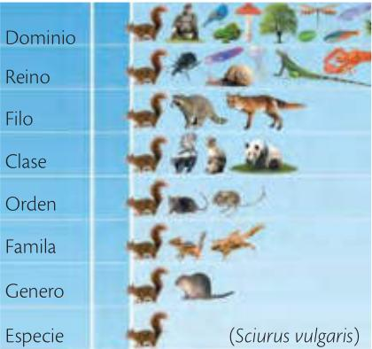
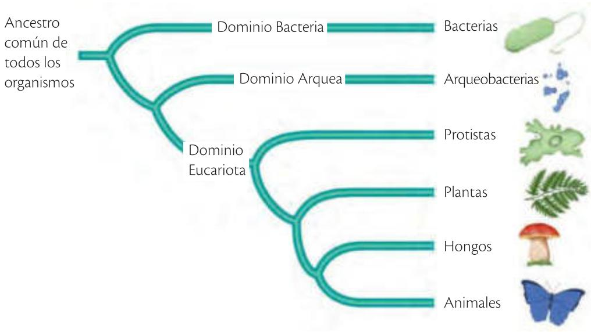
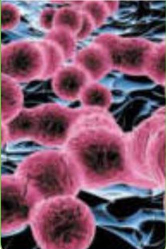
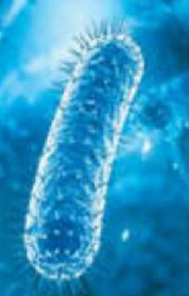
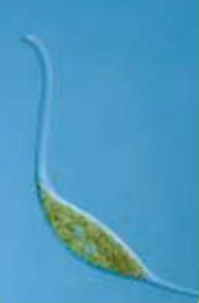
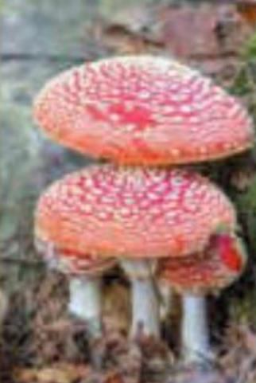
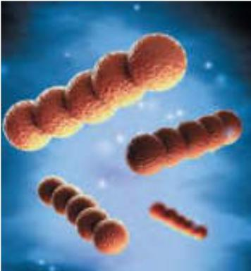
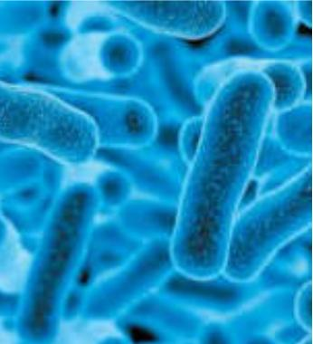
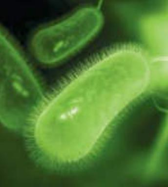
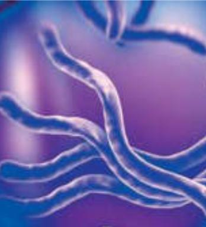

# UNIDAD 1: La clasificación de los seres vivos
## Fuente: Ediciones SM - Ciencias Naturales 10mo EGB
## Páginas: 8-39
## Temas del currículo que cubre: Tema 1 (Niveles de Taxonomía)

---
---

## Niveles de organización de la materia viva (según currículo)

Los seres vivos presentan una organización jerárquica, desde lo más simple a lo más complejo:

| Nivel | Descripción | Ejemplo |
|-------|-------------|---------|
| **Célula** | Unidad básica estructural y funcional de los seres vivos. | Neurona, glóbulo rojo, célula muscular |
| **Tejido** | Conjunto de células similares que realizan una función común. | Tejido epitelial, tejido muscular, tejido nervioso |
| **Órgano** | Estructura formada por varios tejidos que trabajan juntos. | Corazón, pulmón, hígado, estómago |
| **Sistema** | Conjunto de órganos que colaboran para realizar una función vital. | Sistema circulatorio, digestivo, nervioso |
| **Organismo** | Ser vivo completo, formado por todos los sistemas que funcionan de manera integrada. | Ser humano, árbol, perro, bacteria |

### Niveles superiores de organización (ecológicos)
- **Población**: grupo de individuos de la misma especie en un área determinada.
- **Comunidad**: conjunto de poblaciones de diferentes especies que interactúan.
- **Ecosistema**: comunidad + factores físicos (agua, suelo, clima).
- **Bioma**: conjunto de ecosistemas similares (bosque tropical, desierto, tundra).
- **Biósfera**: todos los ecosistemas de la Tierra.

---

## Características distintivas de los seres vivos

Todo ser vivo cumple con las siguientes funciones o características:

| Característica | Explicación |
|----------------|-------------|
| **Organización celular** | Están formados por una o más células (unidad básica de la vida). |
| **Metabolismo** | Realizan reacciones químicas para obtener y transformar energía (nutrición, respiración). |
| **Homeostasis** | Mantienen un equilibrio interno constante (temperatura, pH, concentración de sales). |
| **Irritabilidad** | Responden a estímulos del ambiente (luz, temperatura, sonido, contacto). |
| **Crecimiento** | Aumentan de tamaño y se desarrollan mediante la producción de nuevas células. |
| **Reproducción** | Producen descendencia (puede ser sexual o asexual). |
| **Adaptación** | Evolucionan a lo largo de generaciones para sobrevivir mejor en su entorno. |

---

## Relación entre niveles de organización y procesos evolutivos

- Los primeros seres vivos en la Tierra eran **unicelulares** (procariotas). Con el tiempo, evolucionaron hacia formas **multicelulares** más complejas.
- La **especialización celular** permitió la formación de tejidos, órganos y sistemas. Esta especialización es resultado de la **selección natural**: las células que cooperaban tenían ventaja.
- Los **niveles de organización más altos** (organismos con órganos y sistemas) aparecieron más tarde en la historia evolutiva.
- La taxonomía moderna refleja esta historia: los taxones superiores (dominios, reinos) agrupan organismos según su **plan corporal y nivel de organización**. Por ejemplo:
  - **Dominio Bacteria**: todos unicelulares procariotas (nivel celular).
  - **Reino Animalia**: todos multicelulares con tejidos, órganos y sistemas (nivel organismo complejo).
- Dentro de un mismo nivel de organización, los organismos pueden tener diferentes **grados de complejidad** que reflejan su historia evolutiva (ej: esponjas → cnidarios → anélidos → vertebrados).

> **Idea clave:** La evolución ha producido un aumento en la complejidad de la organización desde células aisladas hasta organismos pluricelulares con sistemas especializados. La clasificación taxonómica intenta reflejar este proceso.

--- 

## Aprenderás:
- El origen de los sistemas de clasificación de seres vivos
- Criterios de clasificación de procariotas, protistas y hongos
- Criterios de clasificación de plantas y animales

---

## 1. El origen de los sistemas de clasificación

### Pregunta exploratoria
¿Cómo crees que conocer la variedad de especies que habita en un lugar ayuda a la conservación de la biodiversidad?

### 1.1 La importancia de la taxonomía y la sistemática

**Taxonomía:** campo de la ciencia que se ocupa de describir y nombrar la diversidad de seres vivos que existe en la naturaleza.

**Sistemática:** ciencia que estudia el parentesco, las relaciones y la historia evolutiva de los seres vivos.

Mediante la sistemática, los científicos han podido establecer el origen y la evolución de algunas especies y grupos biológicos con el apoyo de la taxonomía.

### 1.2 Los primeros sistemas de clasificación

- **Aristóteles (384-322 a.C.):** primero en clasificar organismos en categorías (animales y vegetales). Estableció criterios como animales con y sin sangre.
- **Carl von Linné o Linneo (1707-1778):** propuso organizar a las especies en grupos llamados **taxones**, integrados por especies similares o relacionadas.
- **Charles Darwin (1809-1882):** publicó "El origen de las especies", planteando que todos los organismos están emparentados por un ancestro común.

Cuanto mayor es el número de categorías que dos organismos comparten, más cercana es su relación evolutiva.

### 1.3 La nomenclatura linneana

La **nomenclatura binomial** (linneana) asigna a cada especie un nombre único de origen latino en cursiva con dos partes:

| Parte | Descripción | Ejemplo |
|-------|-------------|---------|
| **Género** | Primera parte, mayúscula inicial | *Canis* |
| **Epíteto específico** | Segunda parte, minúscula | *lupus* |

**Ejemplo:** *Canis lupus* (lobo), *Canis mesomelas* (chacal), *Canis latrans* (coyote) - mismo género, diferentes especies.

---

## 2. La clasificación taxonómica

### 2.1 Los componentes de los sistemas de clasificación taxonómica

#### El carácter taxonómico

| Tipo de carácter | Descripción |
|------------------|-------------|
| **Morfológicos** | Forma del organismo (los más utilizados) |
| **Fisiológicos** | Funciones vitales (reproducción, nutrición) |
| **Citológicos** | Tipo de células |
| **Bioquímicos y moleculares** | Características genéticas (número de cromosomas, composición de sangre) |

#### Las categorías taxonómicas (de menor a mayor)

1. **Especie** (más pequeña)
2. Género
3. Familia
4. Orden
5. Clase
6. Filo (animales) o División (plantas)
7. Reino
8. **Dominio** (mayor)

#### El taxón
Grupos de individuos que conforman una categoría taxonómica (ej: Reino Animal incluye anfibios, reptiles, mamíferos).

### 2.2 La clasificación basada en dominios y reinos

#### Los 3 dominios (propuesto por Carl Woese en 1991)

| Dominio | Características |
|---------|-----------------|
| **Bacteria** | Procariotas |
| **Arquea (Archaea)** | Procariotas que viven en ambientes extremos (altas temperaturas, alta salinidad, bajo pH) |
| **Eucariota** | Eucariotas - incluye 4 reinos: Protista, Hongo (Fungi), Plantae, Animal |

#### Características de Arqueas vs Bacterias

| Característica | Arqueas | Bacterias |
|----------------|---------|-----------|
| Pared celular | Sin peptidoglucano | Con peptidoglucano |
| Lípidos de membrana | Hidrocarburos de cadena ramificada | Ácidos grasos |
| Ambientes | Extremos (termófilas, halófilas, metanógenas) | Variados |

#### Los 6 reinos (clasificación actual)

1. **Arquea** (procariotas extremos)
2. **Bacterias** (procariotas)
3. **Protista** (eucariotas unicelulares)
4. **Hongo (Fungi)** (eucariotas heterótrofos con quitina)
5. **Plantae** (eucariotas autótrofos con celulosa)
6. **Animal** (eucariotas heterótrofos sin pared celular)

---

## 3. El concepto de especie

### 3.1 Concepto biológico de especie (Dobzhansky y Mayr)
Grupo de individuos semejantes que pueden reproducirse entre sí y originar descendencia fértil.

**Limitaciones:** No aplica para organismos asexuales (bacterias) ni para híbridos estériles (mula).

### 3.2 Concepto filogenético de especie
Grupo más pequeño de individuos que proviene de un ancestro común y puede distinguirse de otros conjuntos similares.

### 3.3 Concepto tipológico (morfológico) de especie
Agrupa individuos con base únicamente en características morfológicas observables.

### 3.4 Concepto evolutivo de especie
Linaje que evoluciona por separado de otros grupos con sus propias tendencias evolutivas.

### 3.5 Concepto ecológico de especie
Individuos que comparten el mismo nicho ecológico y los mismos requerimientos ambientales.

---

## 4. La sistemática y la clasificación de las especies

### 4.1 Principales escuelas taxonómicas

| Escuela | Criterio |
|---------|----------|
| **Taxonomía evolutiva** | Genealogía (ascendencia común) + grado de similitud |
| **Fenética o numérica** | Similitud global sin considerar relaciones evolutivas (fenograma) |
| **Cladística** | Solo genealogía, taxones monofiléticos (más utilizada actualmente) |

#### Caracteres en cladística

- **Homólogos:** comparten dos o más especies por descender de un mismo ancestro (ej: aleta de delfín, pata de caballo, ala de murciélago - misma estructura, diferente función)
- **Análogos:** se originan independientemente como adaptaciones al medio (ej: ala de insecto y ala de murciélago - misma función, diferente estructura)

### 4.2 Herramientas de la sistemática
Anatomía, paleontología, biogeografía, técnicas moleculares (ADN, ARN).

### 4.3 Principales características de cada reino (Whittaker)

| Característica | Arquea | Bacteria | Protista | Hongo | Plantae | Animal |
|----------------|--------|----------|----------|-------|---------|--------|
| Tipo de célula | Procariota | Procariota | Eucariota | Eucariota | Eucariota | Eucariota |
| Núcleo | Ausente | Ausente | Presente | Presente | Presente | Presente |
| Nutrición | Autótrofa/heterótrofa | Autótrofa/heterótrofa | Heterótrofa | Heterótrofa | Autótrofa | Heterótrofa |
| Pared celular | Presente (sin peptidoglucano) | Presente (con peptidoglucano) | Variable | Presente (quitina) | Presente (celulosa) | Ausente |
| N° de células | Unicelular | Unicelular | Variable | Multicelular | Multicelular | Multicelular |

---

## 5. La clasificación de los procariotas

### 5.1 Arqueas

| Filo | Características |
|------|-----------------|
| **Crenarqueota** | Termófilas (temperatura >80°C), fuentes termales sulfurosas, fumarolas |
| **Euriarqueota** | Halófilas (alta salinidad), termófilas extremas, metanógenas (producen metano, anaerobias) |

### 5.2 Bacterias

#### Según tinción de Gram

| Tipo | Característica | Color |
|------|----------------|-------|
| **Grampositivas** | Pared gruesa de peptidoglucano | Morado/azul oscuro |
| **Gramnegativas** | Doble membrana, pared delgada | Rojo |

#### Según su forma

| Forma | Nombre | Ejemplo |
|-------|--------|---------|
| Esférica u ovoide | Cocos | Estreptococos (en cadena) |
| Bastoncillo | Bacilos | Diplobacilos (en pares), estreptobacilos (en cadena) |
| Helicoidal similar a bacilo | Espirilos | Sífilis |
| Alargada enrollada | Espiroquetas | Con flagelos especializados |
| Coma | Vibriones | - |

---

## 6. La clasificación de los protistas

### Características generales
- Eucariotas
- Mayoría unicelulares y microscópicos (algunos multicelulares y grandes)
- Nutrición variada (autótrofos o heterótrofos)
- Reproducción sexual o asexual
- Móviles (flagelos, cilios, pseudópodos)

### 6.2 Protozoos (similares a animales, heterótrofos)

| Grupo | Locomoción | Características |
|-------|------------|-----------------|
| **Flagelados** | Flagelos | Primitivos, parásitos o vida libre |
| **Sarcodinos (rizópodos)** | Pseudópodos | Prolongaciones de membrana para moverse y atrapar presas (ej: ameba) |
| **Ciliados** | Cilios | Proyecciones cortas como pelos (ej: paramecio) |
| **Esporozoarios** | No tienen | Parásitos, producen esporas |

### 6.3 Algas (autótrofos)

| Grupo | Características |
|-------|-----------------|
| **Euglenoides** | Unicelulares, flagelo, sin pared celular, aguas dulces |
| **Dinoflagelados** | Unicelulares, dos flagelos, placas de celulosa, giran para desplazarse |
| **Diatomeas** | Pared de sales de sílice, almacenan aceites |
| **Clorófitas (verdes)** | Clorofila, aguas dulces y marinas, unicelulares o coloniales |
| **Rodófitas (rojas)** | Ficobilina (pigmento rojo), zonas profundas, pluricelulares |
| **Feófitas (pardas)** | Fucoxantina, las más grandes, costas rocosas frías |

### 6.4 Mohos acuáticos o mucilaginosos

| Grupo | Características |
|-------|-----------------|
| **Mixomicetos (acelulares)** | Sin pared celular, forman plasmodios (células multinucleadas), textura gelatinosa |
| **Acrasiomicetos (celulares)** | Células ameboides individuales, producen acrasina |
| **Oomicetos** | Filamentosos, parásitos o saprobiontes, células reproductoras flageladas |

---

## 7. La clasificación de los hongos (Fungi)

### Características generales
- Eucariotas
- Pared celular de **quitina**
- Cuerpo compuesto por **hifas** (filamentos) que forman el **micelio**
- Heterótrofos

### 7.2 Clasificación según su nutrición

| Tipo | Alimentación | Importancia |
|------|--------------|-------------|
| **Saprobiontes** | Materia muerta | Descomponedores (reciclan nutrientes) |
| **Parásitos** | Huésped vivo | Pueden causar daño o muerte (pie de atleta, tiña) |
| **Simbiontes** | Asociación beneficiosa | Líquenes (hongo + alga), micorrizas (hongo + raíz de planta) |

### 7.3 Hongos según su morfología (5 grupos o divisiones)

| División | Ejemplo |
|----------|---------|
| Quitridiomicetos | - |
| Cigomicetos | Moho negro del pan (*Rhizopus nigricans*) |
| Glomeromicetos | Micorrizas |
| Ascomicetos | Levaduras |
| Basidiomicetos | Champiñones, setas |

---

## 8. La clasificación de las plantas (Plantae)

### Características generales
- Eucariotas, multicelulares
- Pared celular de **celulosa**
- Ciclo de vida: alternancia de generaciones (esporofito + gametofito)
- Nutrición autótrofa (fotosíntesis)

### Criterios de clasificación
1. Presencia de esporofito multicelular
2. Presencia de vasos conductores (vasculares vs no vasculares)
3. Presencia de raíces
4. Diferenciación de megafilos (hojas muy vascularizadas) y microfilos (hojas reducidas)
5. Producción de semillas
6. Presencia de flores

### 8.3 Briofitas (no vasculares)

| División | Características |
|----------|-----------------|
| **Hepáticas** | Aspecto laminar, rizoides unicelulares, talosas (sin tallo) |
| **Musgos** | Rizoides multicelulares, estructuras similares a raíces y tallos, almacenan agua |
| **Antoceros** | Forma de cuerno, talo con rizoides unicelulares |

### 8.4 Plantas vasculares sin semilla (criptógamas)

| División | Características |
|----------|-----------------|
| **Lycophyta** | Licopodios o pinos rastreros, microfilos libres |
| **Monilophyta** | Helechos (frondes o megafilos con soros que contienen esporangios), equisetos, psilotáceas |

### 8.5 Plantas con semilla (espermatofitas)

#### Gimnospermas (semilla desnuda, sin flores con carpelos)

| División | Características |
|----------|-----------------|
| **Cícadas** | Similares a palmeras, semillas brillantes de colores |
| **Ginkgos** | *Ginkgo biloba*, hojas en abanico |
| **Coníferas** | Pinos, cipreses, secuoyas; hojas aciculadas (tipo aguja) |
| **Gnetofitas** | Efedras, doble fecundación |

#### Angiospermas (con semillas y flores típicas, doble fecundación)

| Característica | Monocotiledóneas (Liliopsida) | Dicotiledóneas (Magnoliopsida) |
|----------------|-------------------------------|-------------------------------|
| **Cotiledones** | 1 | 2 |
| **Hojas** | Nervadura paralela | Nervadura ramificada |
| **Haces vasculares** | Dispersos en el tallo | Dispuestos en anillo |
| **Crecimiento** | Primario (longitud) | Primario y secundario (producen madera) |
| **Piezas florales** | Múltiplos de 3 | Múltiplos de 4 o 5 |
| **Polen** | Un poro | Tres poros |
| **Ejemplos** | Maíz, trigo, arroz, orquídeas | Fréjol, aguacate, rosas |

---

## 9. La clasificación de los animales (Animal)

### Características generales
- Eucariotas, multicelulares
- Matriz extracelular con colágeno
- Nutrición heterótrofa
- Sistemas sensoriales, nervioso y hormonal desarrollados

### Criterios de clasificación de animales
- Diferenciación en tejidos y órganos (poríferos carecen)
- Simetría corporal (radial, bilateral, asimétrica)
- Desarrollo embrionario (diblásticos 2 capas, triblásticos 3 capas)
- Presencia de cavidad corporal (celomados, pseudocelomados, acelomados)
- Formación de la boca en el embrión (protóstomos, deuteróstomos)

#### Tipos de simetría

| Simetría | Características | Ejemplos |
|----------|-----------------|----------|
| **Asimétrica** | Sin simetría | Esponjas marinas |
| **Radial** | Partes alrededor de un punto | Anémonas, estrellas de mar, medusas |
| **Bilateral** | División en dos lados iguales | Mayoría de animales |

#### Tipos de cavidad corporal (celoma)

| Tipo | Características |
|------|-----------------|
| **Celomados** | Cavidad totalmente revestida por tejido |
| **Pseudocelomados** | Cavidad parcialmente revestida |
| **Acelomados** | Sin cavidad, tres capas contiguas |

### 9.3 Animales invertebrados (sin columna vertebral)

| Filo | Características | Ejemplos |
|------|-----------------|----------|
| **Poríferos** | Acuáticos, mayoría marinos, fijos, sistema de canales con poros y ósculos | Esponjas |
| **Cnidarios** | Tentáculos con cnidocitos (células urticantes), ciclo de vida: pólipo (fijo) + medusa (libre) | Medusas, anémonas, corales, hidras |
| **Anélidos** | Cuerpo segmentado, celoma, pared fina | Lombrices de tierra, sanguijuelas, gusanos marinos |
| **Moluscos** | Cuerpo con: pie (locomoción), masa visceral (órganos), manto (segrega concha) | Gasterópodos (caracoles), bivalvos (mejillones), cefalópodos (pulpos, calamares) |
| **Artrópodos** | Apéndices articulados, exoesqueleto de quitina, grupo más diverso | Insectos, arácnidos, crustáceos, miríápodos |
| **Equinodermos** | Marinos, esqueleto interno de placas calcáreas, sistema ambularcal (agua) | Estrellas de mar, erizos, pepinos de mar |

### 9.4 Filos cordados

**Características de los cordados:**
- Notocorda (cordón nervioso dorsal)
- Hendiduras faríngeas
- Cola postanal

| Subfilo | Características | Ejemplos |
|---------|-----------------|----------|
| **Urocordados** | Túnica fuerte, notocorda en la cola | Ascidias, taliáceos |
| **Cefalocordados** | Delgados, comprimidos lateralmente (anfioxos) | *Branchiostoma lanceolatum* |
| **Vertebrados** | Columna vertebral reemplaza a la notocorda | Peces, anfibios, reptiles, aves, mamíferos |

#### Clases de vertebrados

| Clase | Características | Ejemplos |
|-------|-----------------|----------|
| **Peces** | Acuáticos, aletas, branquias | Condrictios (tiburón, raya - cartílago), Osteíctios (mojarra, sardina - hueso) |
| **Anfibios** | Tetrápodos, piel húmeda, ectotermos, branquias en larva, pulmones en adulto | Ranas, sapos, salamandras |
| **Reptiles** | Ectotermos, huevo con cascarón y amnios, piel escamosa | Serpientes, lagartos, cocodrilos, tortugas |
| **Aves** | Endotermos, plumas, alas, sacos aéreos | Pato, avestruz, paloma |
| **Mamíferos** | Pelo, glándulas mamarias (leche), corazón 4 cavidades, vivíparos (excepto monotremas) | Monotremas (ornitorrinco), marsupiales (canguro), placentarios |

---

## Actividades del libro (con respuestas esperadas)

### Actividad 1 (página 11)
**Coloca al frente del nombre de cada científico su aporte:**
- **Carl von Linné:** Nomenclatura binomial (clasificación en taxones)
- **Charles Darwin:** Parentesco evolutivo y ancestro común
- **Aristóteles:** Primera clasificación (animales y vegetales)

### Actividad 2 (página 11)
**¿Cuál es la diferencia entre sistemática y taxonomía?**
- **Taxonomía:** describe y nombra la diversidad de seres vivos
- **Sistemática:** estudia el parentesco, relaciones e historia evolutiva

### Actividad 3 (página 11)
**¿Por qué se llama binomial la nomenclatura propuesta por Linneo?**
Porque cada nombre científico consta de dos partes: Género (mayúscula) + epíteto específico (minúscula).

### Actividad 4 (página 13-14)
**Jerarquía de categorías taxonómicas (de menor a mayor):**
Especie → Género → Familia → Orden → Clase → Filo/División → Reino → Dominio

### Actividad 5 (página 14)
**¿Qué organismos presentan pared celular?**
Reinos: Bacteria, Arquea, Protista (variable), Hongo (quitina), Plantae (celulosa). Animal no tiene.

### Actividad 6 (página 14)
**Clasificación de organismos por reino (ejemplos):**
- Naranja: Plantae
- Ciprés: Plantae
- Loro: Animalia
- Gato: Animalia
- Champiñón: Fungi
- Bacteria: Bacteria
- Alga: Protista

---

## Imágenes sugeridas para incluir

### Descripción del diagrama
El diagrama muestra la clasificación biológica en forma jerárquica (tipo pirámide invertida o escalera), desde lo más general a lo más específico.

#### Niveles representados
1. Dominio  
2. Reino  
3. Filo  
4. Clase  
5. Orden  
6. Familia  
7. Género  
8. Especie  

#### Ejemplo representado (ardilla)
El diagrama utiliza una ardilla como ejemplo de organismo que se clasifica progresivamente:

- Dominio: Eukarya (organismos con núcleo)
- Reino: Animalia (animales)
- Filo: Chordata (con columna vertebral)
- Clase: Mammalia (mamíferos)
- Orden: Rodentia (roedores)
- Familia: Sciuridae (ardillas)
- Género: Sciurus
- Especie: Sciurus vulgaris

#### Interpretación
- A medida que se desciende en la jerarquía:
  - Disminuye el número de organismos
  - Aumenta la similitud entre ellos
- Cada nivel agrupa organismos con características comunes más específicas

### Clasificación de los dominios de la vida

#### Descripción del diagrama
El diagrama representa un árbol evolutivo que muestra cómo todos los organismos provienen de un ancestro común y se dividen en tres dominios principales.

#### Estructura del árbol
- En la base se encuentra:
  - **Ancestro común de todos los organismos**

- A partir de este ancestro se separan tres ramas principales:
  1. Dominio Bacteria
  2. Dominio Arquea
  3. Dominio Eucariota

---

#### Dominio Bacteria
- Representado por organismos bacterianos
- Tipo de célula: procariota (sin núcleo)
- Ejemplo visual en la imagen: bacteria (forma alargada verde)

---

#### Dominio Arquea
- Representado por arqueobacterias
- Tipo de célula: procariota
- Característica destacada: viven en ambientes extremos (implícito en su clasificación)

---

#### Dominio Eucariota
- Tipo de célula: eucariota (con núcleo)
- Se subdivide en varios grupos:

##### Protistas
- Organismos eucariotas simples
- Ejemplo visual: organismo unicelular irregular

##### Plantas
- Organismos fotosintéticos
- Ejemplo visual: hoja

##### Hongos
- Organismos descomponedores
- Ejemplo visual: seta

##### Animales
- Organismos multicelulares
- Ejemplo visual: mariposa

#### Interpretación del diagrama
- El árbol muestra relaciones evolutivas:
  - Todos los seres vivos comparten un origen común
  - Los dominios representan las divisiones más grandes de la vida
- El dominio Eucariota presenta mayor diversificación visible en la imagen

#### Conceptos clave asociados
- Dominios de la vida
- Clasificación biológica
- Evolución
- Ancestro común
- Procariotas vs eucariotas

### Resumen de los dominios

| Dominio   | Tipo de célula | Ejemplos incluidos |
|----------|----------------|-------------------|
| Bacteria | Procariota     | Bacterias         |
| Arquea   | Procariota     | Arqueobacterias   |
| Eucariota| Eucariota      | Protistas, plantas, hongos, animales |

## Características de los reinos
| Caracteristicas de los reinos |

| |  |  |   |  |  |

#### Descripción general
La imagen muestra una tabla comparativa de los seis reinos biológicos, indicando sus características principales: tipo de célula, presencia de núcleo, nutrición, membrana celular, pared celular y número de células.

---

### Comparación por características

#### Tipo de célula
- Arquea: procariota
- Bacteria: procariota
- Protista: eucariota
- Fungi: eucariota
- Plantae: eucariota
- Animal: eucariota

---

#### Núcleo
- Arquea: ausente
- Bacteria: ausente
- Protista: presente
- Fungi: presente
- Plantae: presente
- Animal: presente

---

#### Nutrición
- Arquea: autótrofa o heterótrofa
- Bacteria: autótrofa o heterótrofa
- Protista: autótrofa o heterótrofa
- Fungi: heterótrofa
- Plantae: autótrofa
- Animal: heterótrofa

---

#### Membrana celular
- Arquea: hidrocarburos de cadena ramificada ligados a glicerol mediante enlaces éter
- Bacteria: ácidos grasos de cadena recta ligados a glicerol mediante enlaces éster
- Protista: similar a eucariotas
- Fungi: similar a eucariotas
- Plantae: similar a eucariotas
- Animal: similar a eucariotas

---

#### Pared celular
- Arquea: presente, sin peptidoglucano
- Bacteria: presente, con peptidoglucano
- Protista: variable
- Fungi: presente (quitina)
- Plantae: presente (celulosa)
- Animal: ausente

---

#### Número de células
- Arquea: unicelular
- Bacteria: unicelular
- Protista: variable (unicelular o multicelular)
- Fungi: variable
- Plantae: multicelular
- Animal: multicelular

---

### Interpretación
- Los reinos Arquea y Bacteria son procariotas (sin núcleo)
- Los demás reinos son eucariotas (con núcleo)
- La pared celular está presente en todos excepto en el reino Animal
- La nutrición varía entre autótrofa y heterótrofa según el reino

---

### Palabras clave
- Reinos biológicos
- Clasificación de los seres vivos
- Procariota
- Eucariota
- Pared celular
- Nutrición

---

## Bacteria tipo: Cocos

### Descripción
Las bacterias cocos tienen forma esférica u ovoide.

### Forma
- Esférica o redondeada

### Características principales
- Suelen ser aerobios estrictos (requieren oxígeno)
- No pueden vivir sin oxígeno

### Agrupaciones
- En cadena: estreptococos

### Información adicional
- Pueden formar agrupaciones lineales visibles al microscopio

### Palabras clave
- cocos
- bacterias esféricas
- estreptococos

---

## Bacteria tipo: Bacilos

### Descripción
Las bacterias bacilos tienen forma alargada, similar a un bastón.

### Forma
- Bastoncillo (alargada)

### Características principales
- Se encuentran en diversos ambientes

### Agrupaciones
- En pares: diplobacilos
- En cadenas: estreptobacilos

### Información adicional
- Son una de las formas bacterianas más comunes

### Palabras clave
- bacilos
- bacterias alargadas
- diplobacilos
- estreptobacilos

---

### Bacteria tipo: Espirilos

#### Descripción
Las bacterias espirilos tienen forma helicoidal o en espiral.

#### Forma
- Helicoidal (similar a una espiral)

#### Características principales
- Son bacterias gramnegativas
- Poseen flagelos

#### Información adicional
- Algunas pueden causar enfermedades como la sífilis
- Pueden ser patógenas

#### Palabras clave
- espirilos
- bacterias helicoidales
- bacterias gramnegativas

---

## Bacteria tipo: Espiroquetas

### Descripción
Las espiroquetas son bacterias alargadas con forma helicoidal flexible.

### Forma
- Alargada y enrollada

### Características principales
- Son bacterias gramnegativas
- Presentan filamentos axiales

### Movimiento
- Se desplazan gracias a filamentos axiales internos

### Información adicional
- Su movilidad es una característica distintiva

### Palabras clave
- espiroquetas
- bacterias helicoidales
- filamentos axiales
- movilidad bacteriana

## Referencias
- Martínez, M. et al. (2016). *Ciencias Naturales 10mo EGB*. Ediciones SM, Ecuador.
- Woese, C. (1991). Clasificación en tres dominios.
- Whittaker, R.H. (1969). Clasificación en cinco reinos.